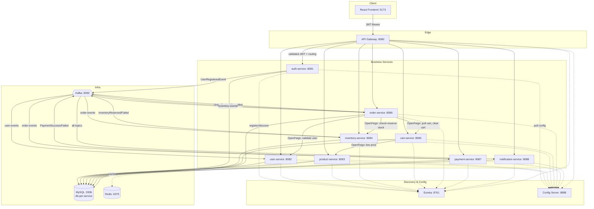
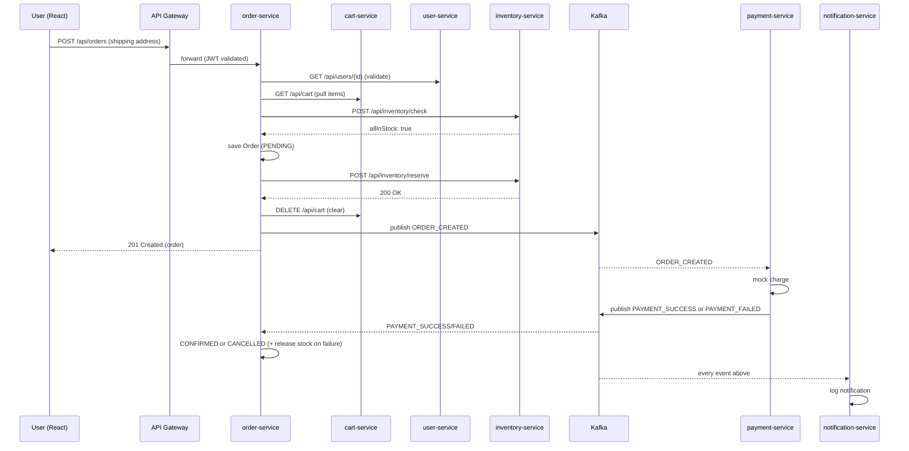

# ShopSphere — Java Spring Boot Microservices E-Commerce Platform

A portfolio-grade, full-stack e-commerce application built as independently
deployable Spring Boot microservices with a React frontend — ** Docker,
no Kubernetes**. Everything runs directly on a local Windows (or any)
machine against locally installed MySQL, Kafka, and Redis.

## 1. Project Overview

12 independently runnable projects:

| # | Service | Port | Purpose |
|---|---|---|---|
| 1 | `service-registry` | 8761 | Eureka service discovery |
| 2 | `config-server` | 8888 | Centralized configuration (native file-based) |
| 3 | `api-gateway` | 8080 | Single entry point, routing, JWT validation, CORS, rate limiting |
| 4 | `auth-service` | 8081 | Registration, login, JWT issuance/refresh, logout |
| 5 | `user-service` | 8082 | Profile, addresses |
| 6 | `product-service` | 8083 | Catalog, categories, search, Redis caching |
| 7 | `inventory-service` | 8084 | Stock levels, reservation |
| 8 | `cart-service` | 8085 | Shopping cart |
| 9 | `order-service` | 8086 | Order lifecycle, checkout orchestration |
| 10 | `payment-service` | 8087 | Mock payment gateway, refunds |
| 11 | `notification-service` | 8088 | Event-driven notification log |
| 12 | `frontend` | 5173 | React SPA |

## 2. Architecture Diagram



### Order placement sequence (the critical path)



## 3. Technology Stack

**Backend:** Java 17, Spring Boot 3.2.5, Spring Web, Spring Data JPA,
Hibernate, Spring Security, JWT (jjwt), Spring Cloud 2023.0.1 (Eureka,
Config Server, Gateway, OpenFeign, Resilience4j Circuit Breaker), Apache
Kafka (spring-kafka), MySQL, Redis, Maven, Lombok, Jakarta Bean
Validation, Spring Boot Actuator, springdoc-openapi (Swagger), JUnit 5,
Mockito, spring-kafka-test (embedded Kafka).

**Frontend:** React 18, Vite, JavaScript ES2022, React Router 6, Axios,
Context API, Tailwind CSS.

**Infrastructure (all local, no Docker):** MySQL, Apache Kafka, Redis,
Eureka, Config Server, API Gateway.

## 4. Database Architecture (database-per-service)

| Database | Owning service |
|---|---|
| `ecommerce_auth` | auth-service |
| `ecommerce_user` | user-service |
| `ecommerce_product` | product-service |
| `ecommerce_inventory` | inventory-service |
| `ecommerce_cart` | cart-service |
| `ecommerce_order` | order-service |
| `ecommerce_payment` | payment-service |
| `ecommerce_notification` | notification-service |

All connect to `localhost:3306`, user `root`, password `root`,
`createDatabaseIfNotExist=true` — no manual `CREATE DATABASE` needed. No
service ever queries another service's database; cross-service reads go
through OpenFeign, cross-service events go through Kafka.

## 5. Kafka Architecture

| Topic | Producer(s) | Consumer(s) |
|---|---|---|
| `user-events` | auth-service | user-service, notification-service |
| `order-events` | order-service | inventory-service, payment-service, notification-service |
| `payment-events` | payment-service | order-service, inventory-service*, notification-service |
| `inventory-events` | inventory-service | order-service, notification-service |

\* inventory-service permanently deducts reserved stock when it sees
`PAYMENT_SUCCESS` for an order it reserved.

Every consumer uses `ErrorHandlingDeserializer` + a `DefaultErrorHandler`
with 3 retries (2s backoff) before publishing to a `<topic>.DLT`
dead-letter topic. Every service-side handler that mutates state is
idempotent against redelivery (checked by orderId or source event id).

## 6. Redis Usage

| Use case | Service |
|---|---|
| Product/category read caching (10 min TTL, evicted on write) | product-service |
| Rate-limiting key resolution (wired, ready to attach to routes) | api-gateway |

Not used for sessions (JWT is stateless) or anything requiring strong
consistency.

## 7. API Documentation

Each service exposes Swagger UI once running:

- auth-service: http://localhost:8081/swagger-ui.html
- user-service: http://localhost:8082/swagger-ui.html
- product-service: http://localhost:8083/swagger-ui.html
- inventory-service: http://localhost:8084/swagger-ui.html
- cart-service: http://localhost:8085/swagger-ui.html
- order-service: http://localhost:8086/swagger-ui.html
- payment-service: http://localhost:8087/swagger-ui.html
- notification-service: http://localhost:8088/swagger-ui.html

## 8. Folder Structure

```
ecommerce/
├── service-registry/
├── config-server/
├── api-gateway/
├── auth-service/
├── user-service/
├── product-service/
├── inventory-service/
├── cart-service/
├── order-service/
├── payment-service/
├── notification-service/
├── frontend/
├── scripts/
│   ├── start-all.bat
│   └── stop-all.bat
├── VERIFICATION_CHECKLIST.md
└── README.md   (this file)
```

Each backend service follows:

```
<service>/
├── pom.xml
├── README.md
└── src/
    ├── main/
    │   ├── java/com/ecommerce/<service>/
    │   │   ├── config/ controller/ dto/ entity/ repository/
    │   │   ├── service/impl/ exception/ security/ mapper/
    │   │   └── kafka/producer|consumer|event/  (where applicable)
    │   └── resources/application.yml
    └── test/
```

## 9. Prerequisites

- JDK 17
- Maven 3.9+
- Node.js 22
- MySQL 8.x
- Apache Kafka (with its bundled Zookeeper, or KRaft mode)
- Redis
- Git
- IntelliJ IDEA (or any IDE) — optional but recommended

## 10. MySQL Setup

Install MySQL locally, then confirm you can connect:

```bash
mysql -u root -p
# password: root
```

No manual schema creation needed — every service connects with
`createDatabaseIfNotExist=true` and `ddl-auto: update`, so each database
and its tables are created automatically on first run.

## 11. Kafka Setup (Windows, Docker)

1. Download Kafka from https://kafka.apache.org/downloads and extract it, e.g. to `C:\kafka`.
2. Start Zookeeper (skip if using Kafka in KRaft mode):
   ```
   cd C:\kafka
   .\bin\windows\zookeeper-server-start.bat .\config\zookeeper.properties
   ```
3. In a new terminal, start the broker:
   ```
   .\bin\windows\kafka-server-start.bat .\config\server.properties
   ```
4. Kafka is now listening on `localhost:9092`. Topics are created
   automatically by each service on startup (`NewTopic` beans) — no
   manual `kafka-topics.bat --create` needed, though you can inspect them:
   ```
   .\bin\windows\kafka-topics.bat --bootstrap-server localhost:9092 --list
   ```

## 12. Redis Setup (Windows, Docker)

Redis doesn't officially support Windows, but two straightforward options:

- **Memurai** (Redis-compatible, native Windows): https://www.memurai.com/get-memurai — install and it runs as a Windows service on port 6379 out of the box.
- **WSL2**: install Redis inside a WSL2 Ubuntu instance (`sudo apt install redis-server`, `redis-server --daemonize yes`) — it's still reachable at `localhost:6379` from Windows.

Confirm it's up:
```
redis-cli ping
# PONG
```

## 13. Environment Variables

Backend services use hardcoded local-dev defaults in
`config-server/src/main/resources/config-repo/application.yml` (JWT
secret, MySQL credentials, Kafka/Redis hosts) — intentional for a
local-only learning project; for anything beyond local dev these would
move to real environment variables / a vault.

Frontend:

| Variable | Default | File |
|---|---|---|
| `VITE_API_BASE_URL` | `http://localhost:8080` | `frontend/.env` (copy from `.env.example`) |

## 14. Local Setup — Order of Operations

1. Start MySQL, Kafka, Redis (sections 10–12).
2. Extract every service zip into one parent folder (e.g. `C:\ecommerce\`), so you have `C:\ecommerce\service-registry\`, `C:\ecommerce\config-server\`, etc.
3. Either run `scripts\start-all.bat` from that parent folder, **or** start manually in this order (each needs ~15–25s to register with Eureka before the next tier starts):
   1. `service-registry`
   2. `config-server`
   3. `api-gateway`
   4. `auth-service`, `user-service`
   5. `product-service`, `inventory-service`
   6. `cart-service`, `order-service`
   7. `payment-service`, `notification-service`
4. Confirm all 9 business services + gateway show **UP** at http://localhost:8761.
5. Start the frontend (section 16).

## 15. Running an Individual Service

Every service is independently runnable — from its own folder:

```bash
mvn clean install
mvn spring-boot:run
```

(`service-registry` and `config-server` should already be running for any
business service to fully initialize, though `fail-fast: false` means
they'll still start and retry in the background if not.)

## 16. Frontend Setup

```bash
cd frontend
npm install
cp .env.example .env
npm run dev
```

Visit http://localhost:5173.

## 17. Testing

Every backend service has its own test suite (JUnit 5 + Mockito, plus
MockMvc for controllers and embedded Kafka for services with consumers):

```bash
cd <service>
mvn test
```

All tests run against in-memory H2 (MySQL-compatible mode) and, where
relevant, an embedded Kafka broker — **no local MySQL/Kafka/Redis is
required to run the test suites**, only to run the services themselves.

See `VERIFICATION_CHECKLIST.md` in this folder for a full manual
end-to-end verification pass once everything is running together.

## 18. Sample API Requests

```bash
# Register
curl -X POST http://localhost:8080/api/auth/register \
  -H "Content-Type: application/json" \
  -d '{"email":"jane@example.com","password":"password123","firstName":"Jane","lastName":"Doe"}'

# Login
curl -X POST http://localhost:8080/api/auth/login \
  -H "Content-Type: application/json" \
  -d '{"email":"jane@example.com","password":"password123"}'

# Browse products (public)
curl http://localhost:8080/api/products

# Add to cart (replace <token>)
curl -X POST http://localhost:8080/api/cart/items \
  -H "Authorization: Bearer <token>" \
  -H "Content-Type: application/json" \
  -d '{"productId":"<productId>","quantity":2}'

# Checkout
curl -X POST http://localhost:8080/api/orders \
  -H "Authorization: Bearer <token>" \
  -H "Content-Type: application/json" \
  -d '{"shippingRecipientName":"Jane Doe","shippingPhoneNumber":"+15551234567","shippingAddressLine1":"123 Main St","shippingCity":"Springfield","shippingState":"IL","shippingPostalCode":"62704","shippingCountry":"USA"}'
```

More examples in each service's own README.

## 19. Kafka Topics Reference

`user-events`, `order-events`, `payment-events`, `inventory-events`, plus
a `.DLT` dead-letter counterpart for each (`user-events.DLT`,
`order-events.DLT`, `payment-events.DLT`, `inventory-events.DLT`).

## 20. Future Improvements

- Replace `ddl-auto: update` with versioned migrations (Flyway/Liquibase) per service.
- Add a platform-wide admin order-listing endpoint (currently `GET /api/orders` is always caller-scoped — see `order-service`/frontend READMEs).
- Add admin order-status transitions beyond cancel (SHIPPED, DELIVERED, etc.).
- Replace `MockPaymentGateway` with a real Stripe/Razorpay adapter (the `PaymentGateway` interface is designed for exactly this swap).
- Add a real wishlist microservice instead of the current client-side-only implementation.
- Externalize secrets (JWT signing key, DB credentials) to environment variables or a vault instead of the config-repo YAML.
- Add distributed tracing (e.g. Micrometer + Zipkin) using the `X-Correlation-Id` header the gateway already generates.
- Add contract tests between services (e.g. Spring Cloud Contract) for the Kafka event schemas and Feign client contracts, which today are duplicated by hand in each consuming service.

---

Built across 7 phases: architecture → infrastructure (Eureka/Config/Gateway)
→ auth/user → product/inventory → cart/order → payment/notification →
frontend → this final integration pass. See each service's own `README.md`
for endpoint-level detail, and `VERIFICATION_CHECKLIST.md` for the
end-to-end test pass.
